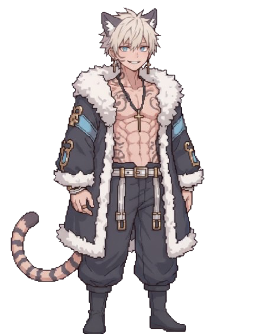

<h1 align="center">Hi, I'm Tiger228 (Tyler) 👋</h1>

<p align="center">
  
</p>

<div align="center">
<table>
<tr>
<td width="130" align="center" valign="middle">
  
</td>
<td valign="middle">

```
┌──────────────────────────────────────────────┐
│ TIGER228                                     │
├──────────────────────────────────────────────┤
│ A wild Software Engineer / Game Engineer     │
│ appears!                                     │
│                                              │
│ > Loves shipping real projects, tinkering    │
│   with game engines, and one too many cups   │
│   of lemon tea.                          [▼] │
└──────────────────────────────────────────────┘
```

</td>
</tr>
</table>
</div>

<p align="center">
  
</p>

<p align="center">
  <a href="https://tyhstudio.com"></a>
  <a href="https://www.linkedin.com/in/tyler-tam-s228"></a>
  <a href="mailto:tiger228.tyh@outlook.com"></a>
  <a href="https://www.buymeacoffee.com/tiger228"></a>
</p>

<p align="center">
  
  
  
  
</p>

---

##  About

-  **Working** — Part-time Software Engineer at **Pivotal Technologies Limited**
-  **Studying** — B.Eng. in Computer Engineering at **CUHK** (Expected 2027)
-  **Goals** — Software Engineer · Game Engineer | What I've made can genuinely helping people
-  **Passion from** — Animation, Music, Coding & Storytelling
-  **Time Zone** — Hong Kong · HKT (UTC+8)

---

<p align="center">
  
</p>

##  Tech Stack

### Programming Languages
<p align="left">
  
</p>

### Frontend & Frameworks
<p align="left">
  
</p>

### Backend & Frameworks
<p align="left">
  
</p>

### Game Engines
<p align="left">
  
</p>

### Databases & Cloud
<p align="left">
  
</p>

### Dev Tools
<p align="left">
  
</p>

---

##  GitHub Stats

<p align="left">
  
</p>


